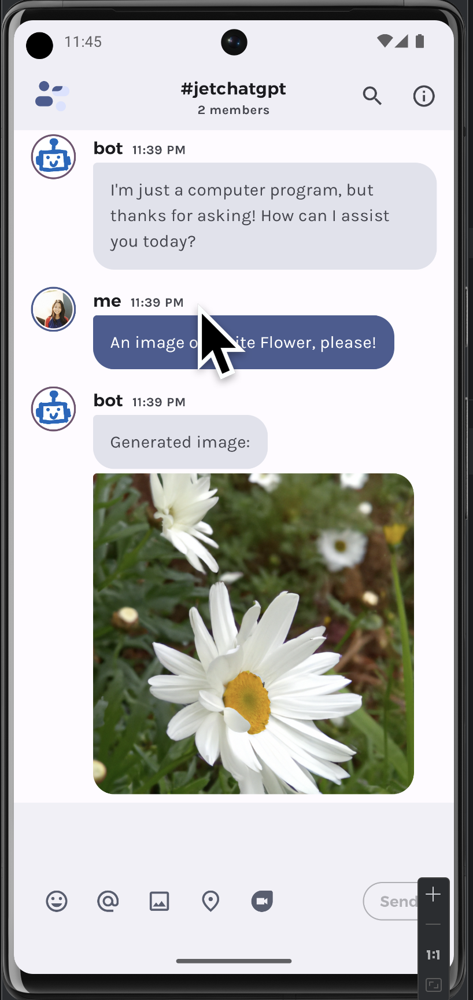

# JetChatGPT

This is a fork of https://github.com/khalp/compose-samples/pull/2/files by the team at Microsoft. Read more: https://devblogs.microsoft.com/surface-duo/android-openai-chatgpt-5/

Thanks to the developers at Microsoft for their contribution to the Jetpack Compose community!

## Overview

This repo adds support for ID detection for Maestro UI testing for Jetpack Compose. Maestro is a UI testing framework for Mobile apps.

For example, search for `testTagsAsResourceId` in `ConversationFragment.kt` and for `testTag` in `UserInput.kt`.

Not sure what are those?

Check out the [Tweet](https://twitter.com/mobile__dev/status/1656399126962278401) and [Docs](https://maestro.mobile.dev/platform-support/android-jetpack-compose) for more info.

## Demo



## How to run

After you clone and open the project in Android Studio, add your own Open AI API key in `OpenAIWrapper.kt` file:

```kotlin
private val openAIToken: String = "YOUR_OPENAI_API_KEY"
``` 

Then, you can run the app on your device or emulator.

## How to test

```agsl
maestro test .maestro/flow.yaml
```

